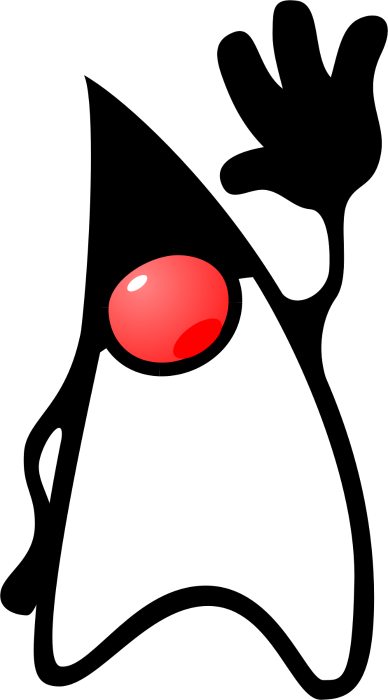

<!-- .slide: data-state="main" data-background="../../images/master.png" data-background-size="contain" -->
# Java Programming <!-- .element: style="text-align: center;font-size: 2em;" -->

---

# Part 1 Overview

- Characteristics
- Platform
- Java code structure

---

## Characteristics

- Simple, Object Oriented, and Familiar
- Robust and Secure
- Architecture Neutral and Portable
- High Performance
- Interpreted, Threaded, and Dynamic

<br>


Note:

Simple doesn't mean easy to create program, programming is always hard.
- Automatic memory management (GC)
- Simplifies pointer handling
- Simple Network Library (Socket/DBMS)
- Designed to be object oriented from the ground up
- C++ syntax streamlined
- C# similarity
- Has a rich set of standard libraries: networking, thread, persistence, data structure, web service
- Restrictions on permissible operations can be enforced: memory manipulation, applet by default has no permission to read/write file and execute local program
- Extensive compile-time checking, and run-time checking for security
- JVM optimization
- Static compile time, Dynamic run-time

---

## Platform

A platform is the hardware or software environment in which a program runs.

- Java Virtual Machine (JVM)
- Java Application Programming Interface (API)


<small>The Java platform can be a bit slower than native code due to its platform-independent environment. However Java provides just in time (JIT) compilation and optimization which bring performance close to native code.</small>

---

## JVM Languages

 <!-- .element: width="100%" -->

---

## "Hello World!"

- Code <!-- .element: class="fa-code" -->

```java
package com.mitrais.app;

/**
 * The HelloWorldApp class implements an application that
 * simply prints "Hello World!" to standard output.
 */
public class HelloWorld {
    public static void main(String[] args) {
        System.out.println("Hello World!"); // Display the string.
    }
}
```

- Compile and Run <!-- .element: class="fa-code" -->

```bash
javac HelloWorld.java
java HelloWorld
Hello World!
```

Note:
Discuss about comments syntax, class definition, main method, usage of core library System.out

---

## Java Byte Code

```bash
javap -c  HelloWorld

public class HelloWorld {
  public HelloWorld();
    Code:
       0: aload_0
       1: invokespecial #1      // Method java/lang/Object."<init>":()V
       4: return

  public static void main(java.lang.String[]);
    Code:
       0: getstatic     #2      // Field java/lang/System.out:Ljava/io/PrintStream;
       3: ldc           #3      // String Hello, World!
       5: invokevirtual #4      // Method java/io/PrintStream.println:(Ljava/lang/String;)V
       8: return
}
```

[Java bytecode instruction listings](https://en.wikipedia.org/wiki/Java_bytecode_instruction_listings)

---

## Summary

- Java is a general purpose language: desktop, web, mobile, more
- Java has a number of good features, but not better in every way than all other languages
- What makes Java better is not the language itself but also the JVM
- Reasons for using Java
  - Features, widespread use, tools, and libraries, platform
  - Java is not the only hammer you have

---

## Questions?

 <!-- .element: height="400px" -->

---

# Part 2 Tools Setup

- Maven
- Git
- Unit Test

---

## Maven

- Is a Java build tool (project, dependency management)
- Used for Java projects
- Adopt convention over configuration
- Under Apache Software Foundation (mostly supported by SonaType)


---

## Mindset

- All build systems are essentially the same:
  - Compile Source code
  - Copy Resource
  - Compile and Run Tests
  - Package Project
  - Deploy Project
  - Cleanup
- Describe the project and configure the build
  - You don’t script a build
  - Maven has no concept of a condition
  - Plugins are configured

---

## How does it works?

- Build configured using pom.xml file
- POM = Project Object Model
- Uses standard build order, project layout
- Identifies dependencies in the pom.xml file
- POM can call child POM's

---

## Structure

 <!-- .element: height="500px" -->

---

## Simple POM

```xml
<?xml version="1.0" encoding="UTF-8"?>
<project xmlns="http://maven.apache.org/POM/4.0.0"
         xmlns:xsi="http://www.w3.org/2001/XMLSchema-instance"
         xsi:schemaLocation="http://maven.apache.org/POM/4.0.0
         http://maven.apache.org/maven-v4_0_0.xsd">

    <modelVersion>4.0.0</modelVersion>
    <groupId>com.mitrais.training</groupId>
    <artifactId>java-training</artifactId>
    <packaging>jar</packaging>
    <version>1.0</version>

    <dependencies>
        <dependency>
            <groupId>mysql</groupId>
            <artifactId>mysql-connector-java</artifactId>
            <version>5.1.31</version>
        </dependency>
        <dependency>
            <groupId>junit</groupId>
            <artifactId>junit</artifactId>
            <version>4.12</version>
            <scope>test</scope>
        </dependency>
    </dependencies>
</project>

```